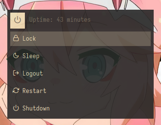
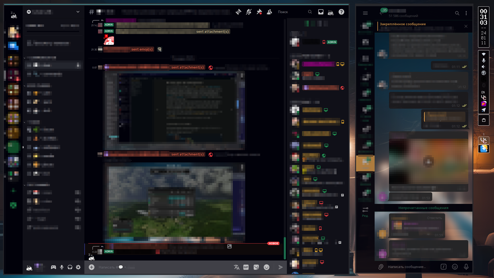

[Русский](README-ru.md) | [English](README.md)

# Дотфайлы
Моя конфигурация Рабочего стола Linux

# OpenBox
## Gruvbox
### Предпросмотр


 


### Шаги установки темы

* Установить эти пакеты: `alacritty openbox obmenu obmenu-generator xfce4-battery-plugin glava compton conky nitrogen pavucontrol pasystray betterlockscreen zsh oh-my-zsh-git`
* Скинуть содержимое папки `/openbox` (кроме `PREVIEWS`) по папкам
* Настроить конфигурации (Сменить директории `/home/user/` и `/home/skullgamer205/` на свои)

Профит...


### Cold Night
Тема создана с помощью Pywalfox
#### Preview





#### Steps to apply theme

1) **Установить пакеты ниже** (Я искал пакеты через `yay` в **Arch.** Другие дисьрибутивы **должны**  (но **не обязаны**) иметь те же имена пакетов...
	```
	{Xorg}
		* xorg-server
		* xorg-xinit
		* xorg-xinput
		* xorg-xrandr
		* xorg-xkbcomp
		* xorg-setxkbmap
	{Оконный менеджер}
		* openbox
		* obkey
		* opensnap (Функциональность Aero Snap в Openbox)
		* obmenu-generator
		* mate-polkit (Интеграция PolicyKit для рабочего стола MATE) (Работает в OB)
	{Украшения для оконного менеджера}
		* nitrogen
		* picom-ftlabs-git
		* glava
		* conky
		* [ опционально ] xsnow
	[ опционально ] {Настройки с интрефейсом}
		* [ опционально ] obconf (Если захочешь настроить OB в пару кликов)
		* [ опционально ] lxappearance (Если захочешь настроить тема в пару кликов)
		* [ опционально ] lxappearance-obconf (Патч для lxappearance для "современной" и "комфортной" настройки темы)
	{Панель}
		* tint2
		{Трей}
			* [ опционально ] mictray (Легковесное приложение, позволяющее управлять состоянием и громкостью микрофона с панели задач)
			* [ опционально ] network-manager-applet (Апплет для управления сетевыми подключениями)
			* [ опционально ] xxkb (переключатель/индикатор раскладки клавиатуры)
			* [ опционально ] blueman (GTK+ Bluetooth-менеджер)
			* [ опционально ] xfce4-battery-plugin (Плагин монитора батареи для панели Xfce) (И Tint2)
			* greenclip (Простой менеджер буфера обмена, который можно интегрировать с rofi)
			* rofi-greenclip
	{Инструменты}
		* flameshot (Менеджер снимков экрана)
		* easystroke (Используйте жесты мыши для запуска команд и горячих клавиш)
		* betterlockscreen (Простой, минималистичный экран блокировки)
	{Прочее}
		* [ ШРИФТЫ ] ttf-terminus-nerd
		* [ ИКОНКИ ] neru-icon-newyear-theme
``

2) Скачать репозиторий *( или только папку "COLD_NIGHT")*.
3) Распаковать репозиторий (в безопасное место)
4) Отредактировать некоторые файлы ( Заменить **USER-NAME-PLACE-HERE** на **твой юзернейм** *( используй `whoami` чтобы узнать свой юзернейм)*.
5) Переместить содержимое папки COLD-NIGHT", **за исключением папки "PREVIEWS"**, в нужные директории.
6) Применить тему.

**ПРОФИТ.**

