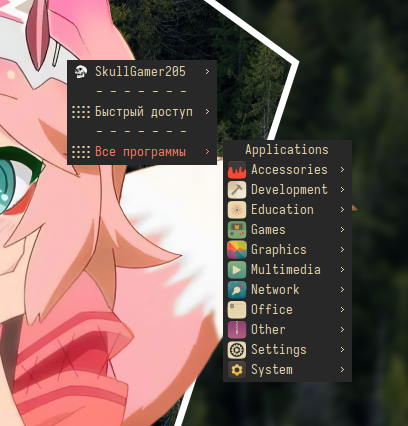

[Русский](README-ru.md) | [English](README.md)

# Дотфайлы
Моя конфигурация Рабочего стола Linux

# OpenBox

### Предпросмотр

 

#
### Шаги установки темы

* Установить эти пакеты: `alacritty openbox obmenu obmenu-generator xfce4-panel xfce4-whiskermenu-plugin xfce4-battery-plugin xfce4-datetime-plugin xfce4-cpufreq-plugin xfce4-clipman-plugin xfce4-xkb-plugin glava picom-ibhagwan-git conky nitrogen pavucontrol pasystray betterlockscreen zsh oh-my-zsh-git`
* Скинуть содержимое папки `/openbox` (кроме `PREVIEWS`) по папкам
* Настроить конфигурации (Сменить директории `/home/user/` и `/home/skullgamer205/` на свои)

Профит...
