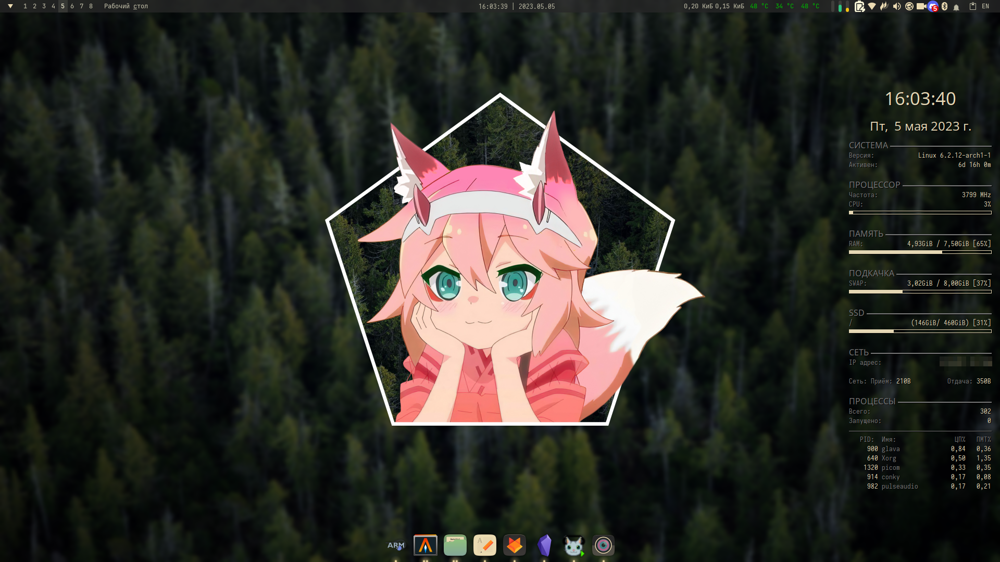
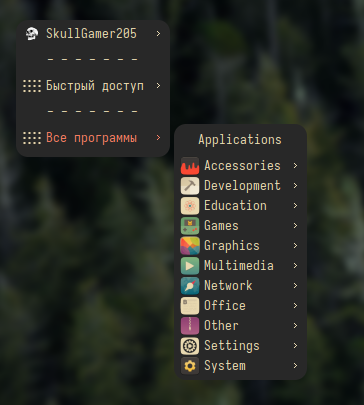
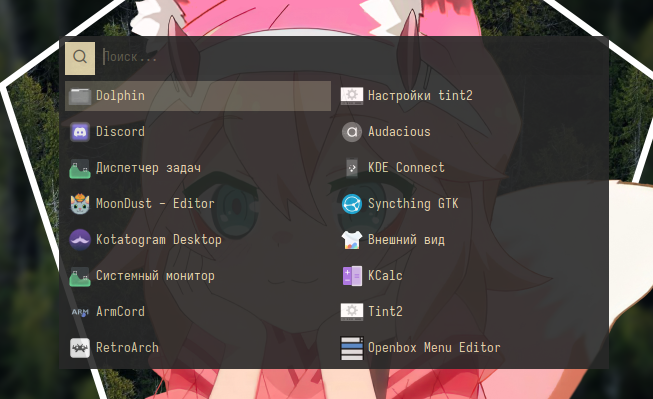
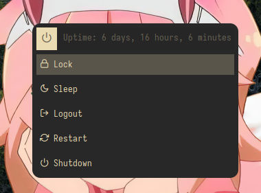

[Русский](README-ru.md) | [English](README.md)

# Dotfiles
My Linux Desktop Configuration Compilation

# OpenBox

### Preview

 

#
### Steps to apply theme

* Install this packages: `alacritty openbox obmenu obmenu-generator xfce4-panel xfce4-whiskermenu-plugin xfce4-battery-plugin xfce4-datetime-plugin xfce4-cpufreq-plugin xfce4-clipman-plugin xfce4-xkb-plugin plank glava xcompmgr`( or `picom-ibhagwan-git`)` conky nitrogen pavucontrol pasystray betterlockscreen zsh oh-my-zsh-git`
* Drop content (exclude `PREVIEWS`) into folders
* Customize configurations (Change directories `/home/user/` and `/home/skullgamer205/` to your own)

Profit.
