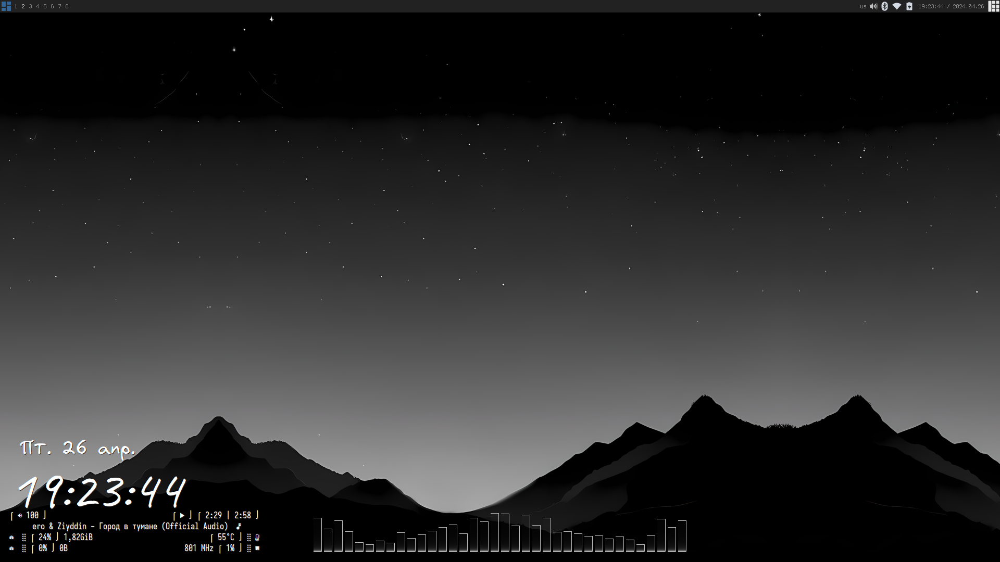
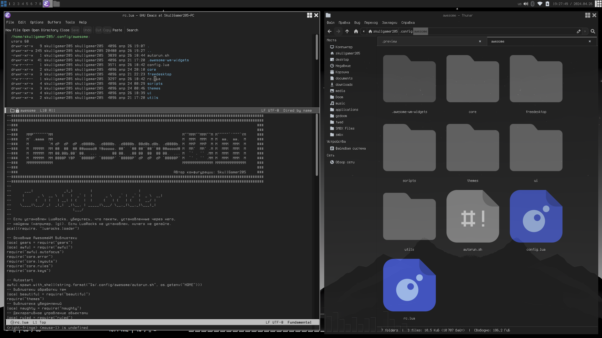
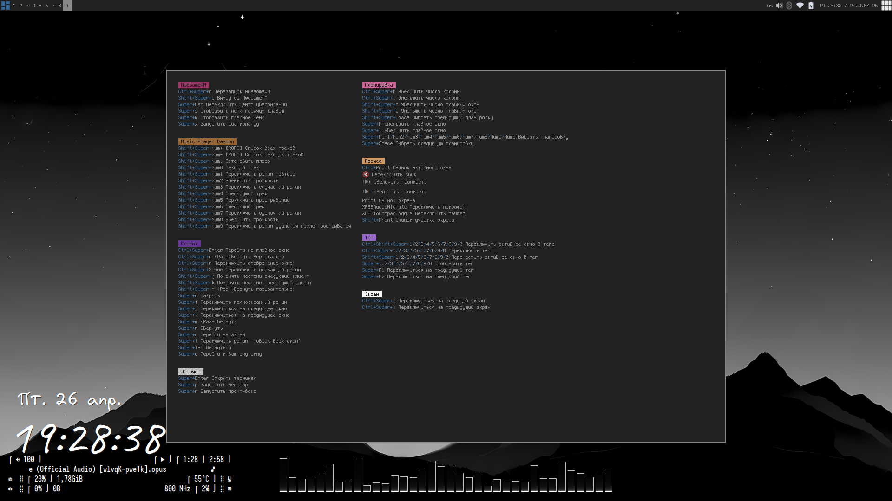
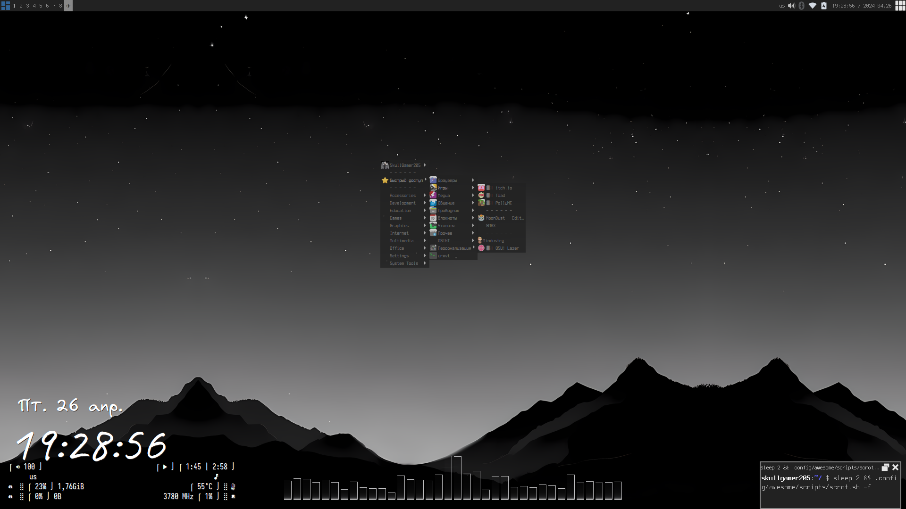
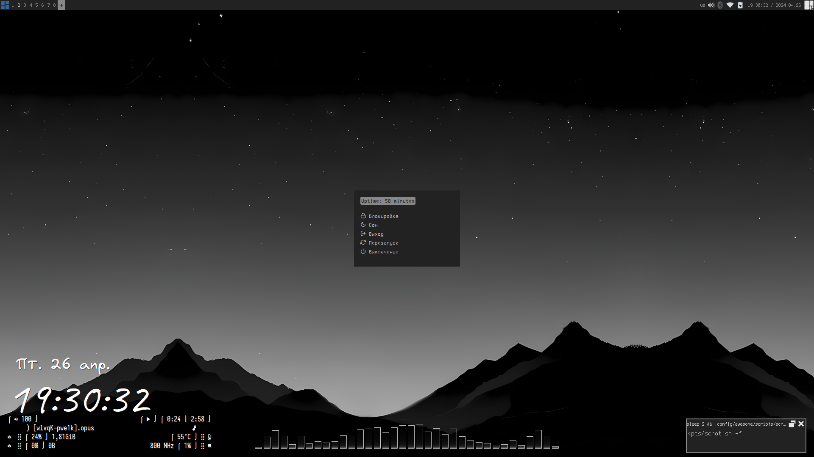

[🔙 Ифсл](https://github.com/SkullGamer205/dotfiles)

[🇷🇺 Русский](README-ru.md) | [🇺🇲 English](README.md)

**
SkullGamer205's configuration'
**

# Introdution

  A little about my desktop.

| **Distro** | EndeavourOS |
|:---------------:|:-----------:|
|**WM**|[AwesomeWM](https://github.com/awesomeWM/awesome/)|
|**Compositor**|[Picom](https://github.com/FT-Labs/picom)|
|**Launcher**|[Rofi](https://github.com/davatorium/rofi/)|
|**Terminal**|[Urxvt](https://github.com/exg/rxvt-unicode)|
|**Shell**|[Zsh](https://www.zsh.org/)|
|**Editor**|[Emacs](https://github.com/emacs-mirror/emacs)|

# List of software

    awesomewm, picom, rofi, urxvt, zsh, emacs, nm-tray, conky, glava, blueman, pavucontrol, pipewire, mate-policy-kit, mate-power-manager, pywal, themix, betterlockscreen

# Gallery

# Sources

Source of inspiration (Appearance; correct organization of scripts; notification center (Yes, I didn’t write the notification center, because I didn’t quite understand how to write it))
-  [HoNamDuong's dotfiles'](https://github.com/HoNamDuong/.dotfiles)

AwesomeWM Documentation
-  [Тут](https://awesomewm.org/apidoc/index.html)
