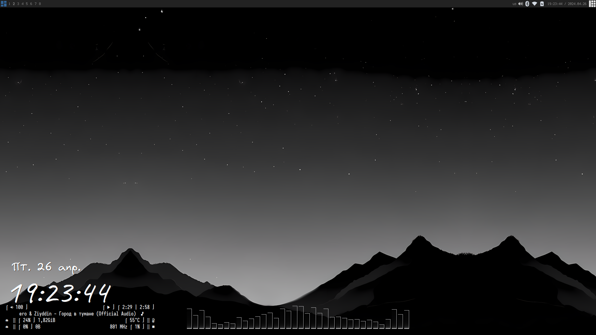
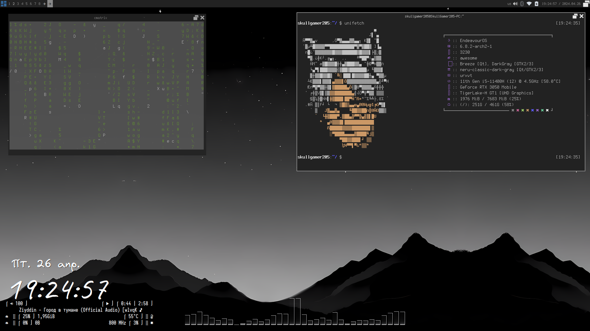
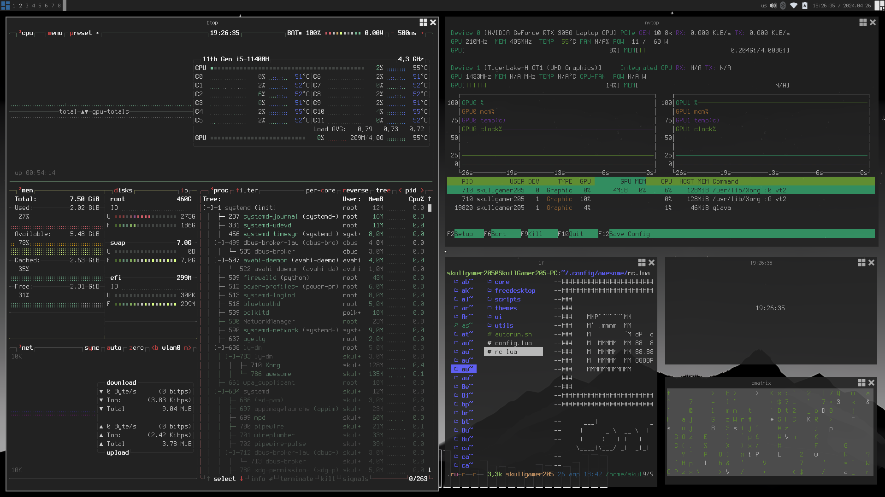
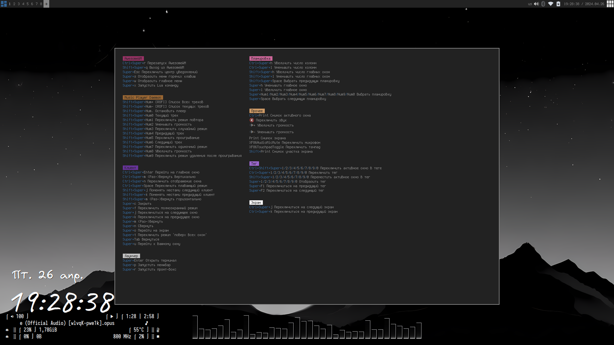
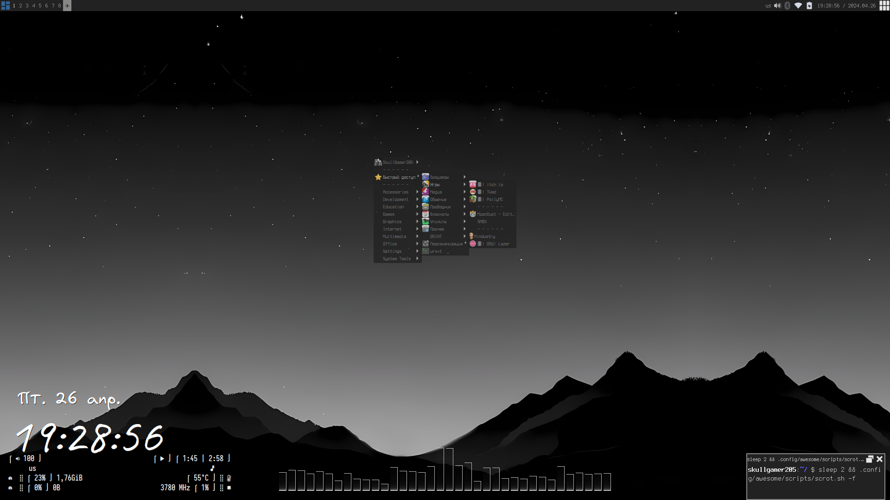
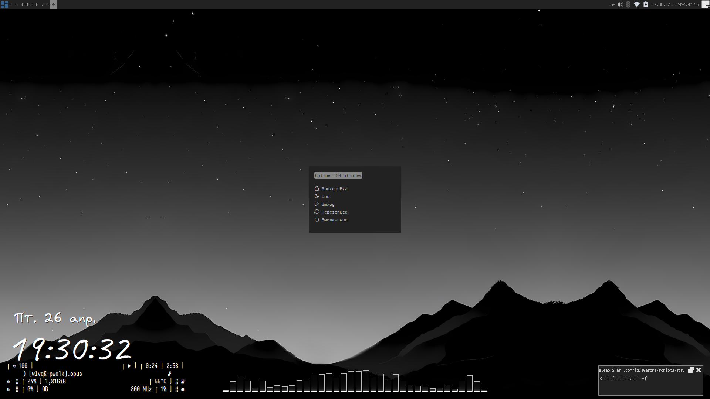
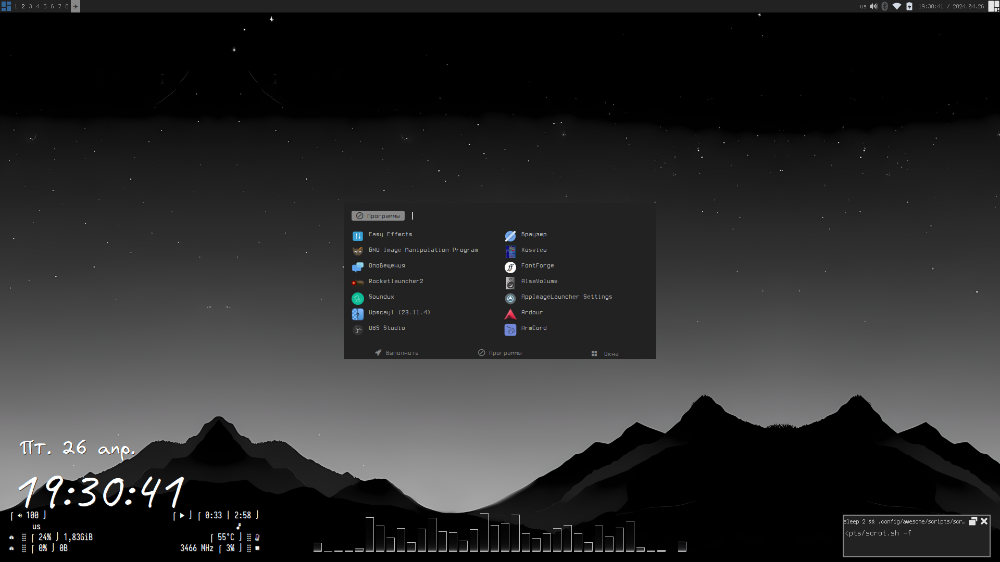
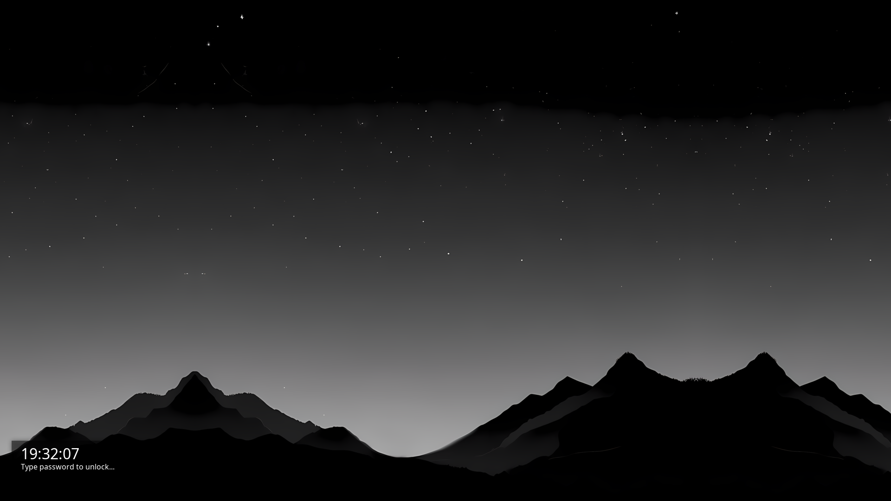

[🔙 Вернуться](https://github.com/SkullGamer205/dotfiles)

[🇷🇺 Русский](README-ru.md) | [🇺🇲 English](README.md)

**
Конфигурация от SkullGamer205
**

# Вступление

  Немного о моём рабочем столе.

| **Дистрибутив** | EndeavourOS |
|:---------------:|:-----------:|
|**Оконный менеджер**|[AwesomeWM](https://github.com/awesomeWM/awesome/)|
|**Композитный менеджер**|[Picom](https://github.com/FT-Labs/picom)|
|**Лаунчер**|[Rofi](https://github.com/davatorium/rofi/)|
|**Терминал**|[Urxvt](https://github.com/exg/rxvt-unicode)|
|**Оболочка**|[Zsh](https://www.zsh.org/)|
|**Редактор**|[Emacs](https://github.com/emacs-mirror/emacs)|

# Список софта

    awesomewm, picom, rofi, urxvt, zsh, emacs, nm-tray, conky, glava, blueman, pavucontrol, pipewire, mate-policy-kit, mate-power-manager, pywal, themix, betterlockscreen

# Галерея

# Источники

Источник вдохновления (Внешний вид; правильная организация скриптов; центр уведомлений (Да, центр уведомлений написал не я, ибо я не совсем понял, как его написать))
-  [Дотфайлы HoNamDuong](https://github.com/HoNamDuong/.dotfiles)

Документация AwesomeWM
-  [Тут](https://awesomewm.org/apidoc/index.html)
