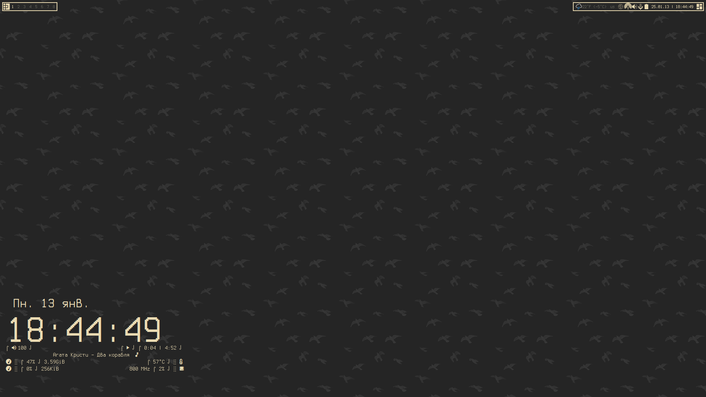
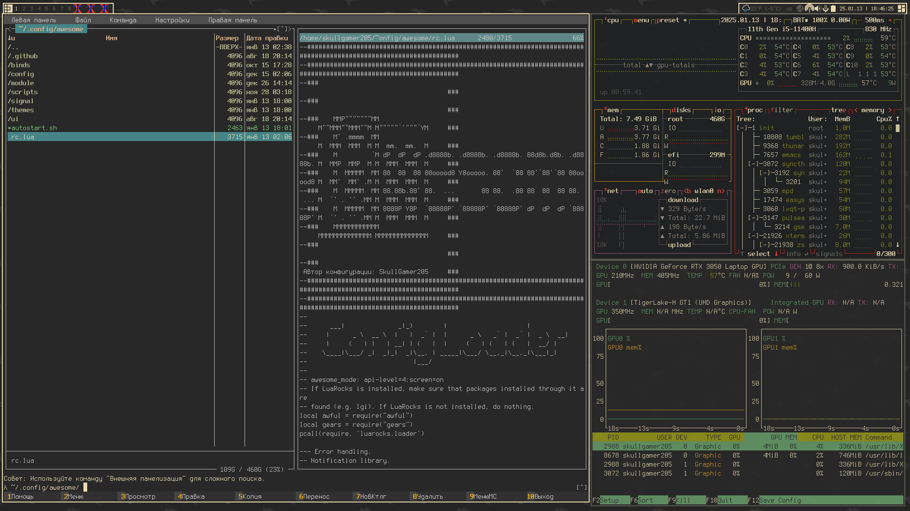
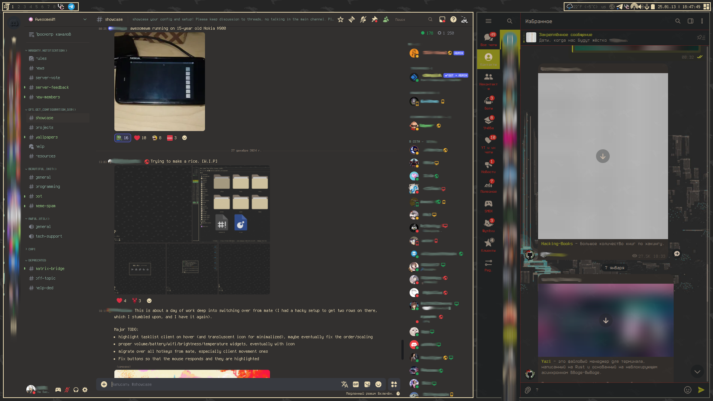
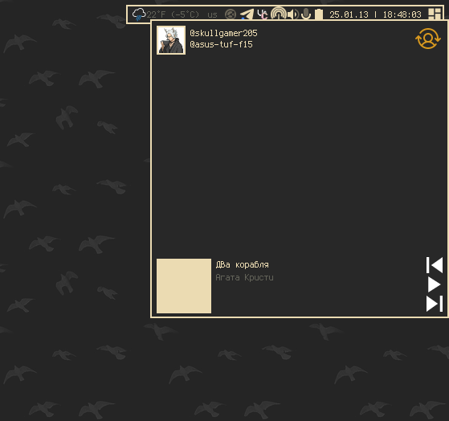
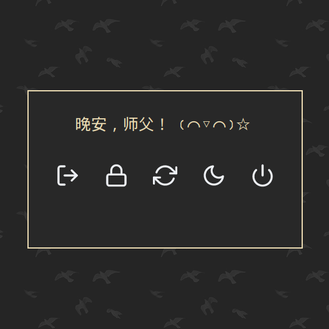
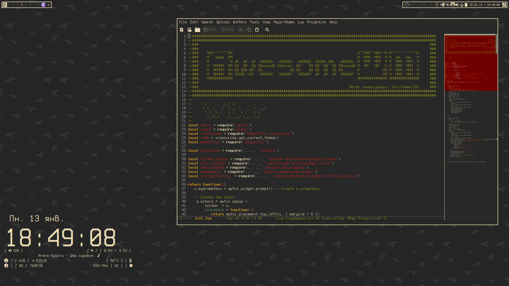
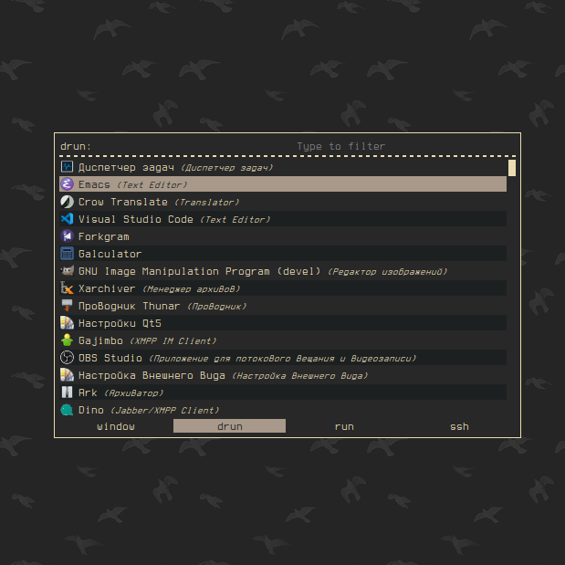
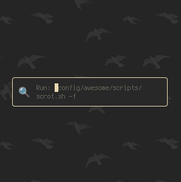
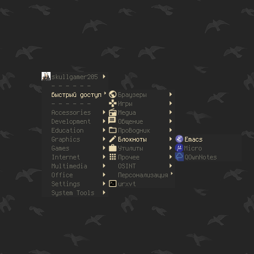

[🔙 Вернуться](https://github.com/SkullGamer205/dotfiles/blob/main/README-ru.md#dynamic-wip)

|[🇷🇺 Русский](README-RU.md) | [🇺🇲 English](README.md)|
|-|-|

****

**
Конфигурация от SkullGamer205
**

Конфигурация находится в разработке

финальный результат может отличаться от текущего

Последняя правка: 2025.04.03

# Вступление

  Немного о моём рабочем столе.

| **Дистрибутив** | [Artix](https://artixlinux.org/) |
|:---------------:|:-----------:|
|**Оконный менеджер**|[AwesomeWM](https://github.com/awesomeWM/awesome/)|
|**Композитный менеджер**|[Picom](https://github.com/FT-Labs/picom)|
|**Лаунчер**|[Rofi](https://github.com/davatorium/rofi/)|
|**Терминал**|[Urxvt](https://github.com/exg/rxvt-unicode)|
|**Оболочка**|[Zsh](https://www.zsh.org/)|
|**Редактор**|[Vim](https://github.com/vim/vim)|

# Список софта

    awesomewm, picom, rofi, urxvt, zsh, emacs, vim, conky, pavucontrol, mate-policy-kit, easystroke, mpd, mpd-mpris, playerctl, bluetuith, nmtui, lua, lua-cjson, lua-lgi, lua-pam, lua53, luajit, luarocks, fastfetch
	
# Галерея

Gallery

# Источники

Использованные ресурсы
* [Модульный пример rc.lua](https://github.com/Gwynsav/modular-awm-default)
* [Готовые базовые виджеты](https://github.com/streetturtle/awesome-wm-widgets)
* [Lain](https://github.com/lcpz/lain)
* [FreeDesktop (Генерация ПКМ меню)](https://github.com/lcpz/awesome-freedesktop)
* [Awesome Buttons](https://github.com/streetturtle/awesome-buttons)
* [Awesome Cyclefocus](https://github.com/blueyed/awesome-cyclefocus)
* [Leaved Layout](https://github.com/michaelbeaumont/awesome-leaved)
* [Awesome Retain](https://github.com/Veratil/awesome-retain)
* ["Умные" границы](https://github.com/intrntbrn/smart_borders)
* [Layout Machi](https://github.com/xinhaoyuan/layout-machi)
* [Calla Lockscreen](https://github.com/Stardust-kyun/calla)

Документация AwesomeWM
-  [Тут](https://awesomewm.org/apidoc/index.html)
