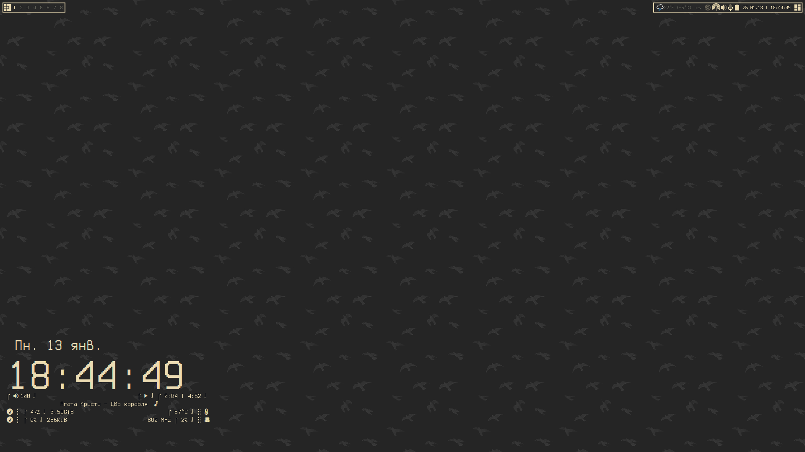
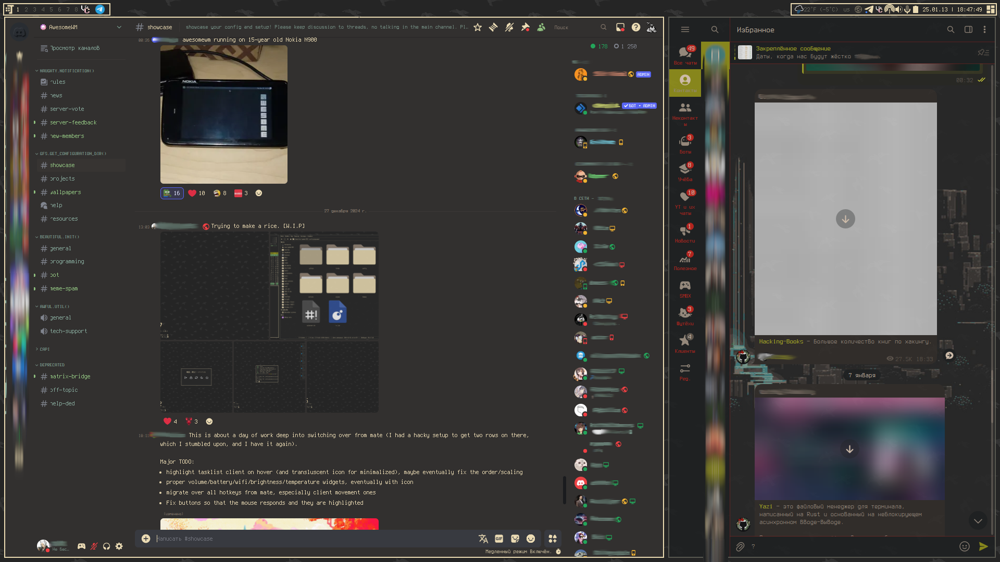
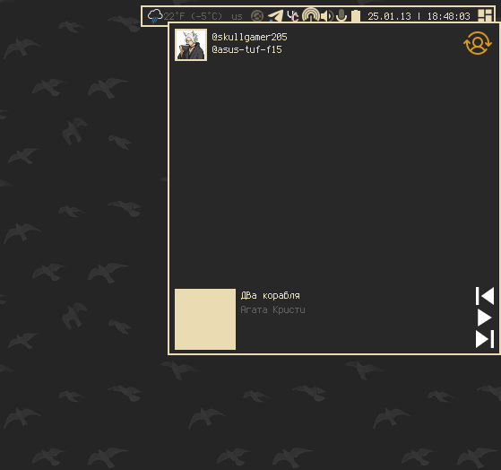
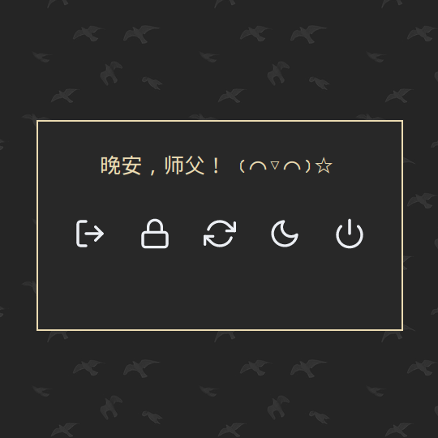
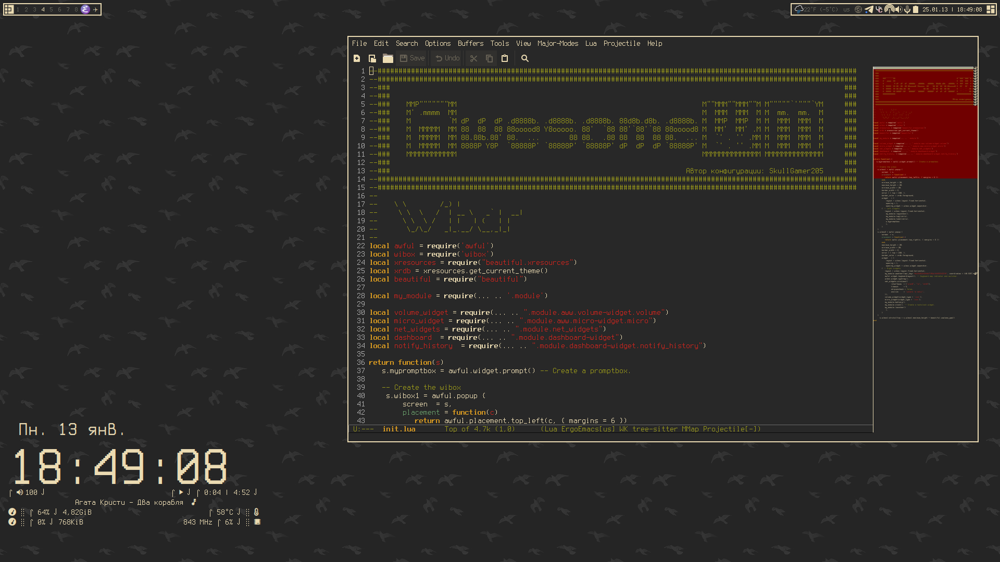
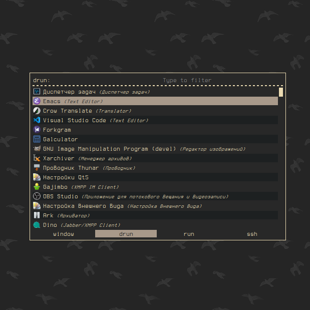

[🔙 Вернуться](https://github.com/SkullGamer205/dotfiles/blob/main/README-ru.md#dynamic-wip)

|[🇷🇺 Русский](README-RU.md) | [🇺🇲 English](README.md)|
|-|-|

****

**
SkullGamer205's configuration
**

Currently, dotfiles under construction

Final result can be different from current

# Introdution

  A little about my desktop.

| **Distro** | [Artix](https://artixlinux.org/) |
|:---------------:|:-----------:|
|**WM**|[AwesomeWM](https://github.com/awesomeWM/awesome/)|
|**Compositor**|[Picom](https://github.com/FT-Labs/picom)|
|**Launcher**|[Rofi](https://github.com/davatorium/rofi/)|
|**Terminal**|[Urxvt](https://github.com/exg/rxvt-unicode)|
|**Shell**|[Zsh](https://www.zsh.org/)|
|**Editor**|[Emacs](https://github.com/emacs-mirror/emacs) & [Vim](https://github.com/vim/vim)|

# List of software

    awesomewm, picom, rofi, urxvt, zsh, emacs, vim, conky, pavucontrol, mate-policy-kit, easystroke, mpd, mpd-mpris, playerctl, bluetuith, nmtui
	
# Gallery

Gallery

# Sources

Used Sources
* [Modularized example rc.lua](https://github.com/Gwynsav/modular-awm-default)
* [Set of Awesome Window Manager's widgets](https://github.com/streetturtle/awesome-wm-widgets)
* [Lain](https://github.com/lcpz/lain)
* [FreeDesktop (RMC Menu generator)](https://github.com/lcpz/awesome-freedesktop)
* [Awesome Buttons](https://github.com/streetturtle/awesome-buttons)
* [Awesome Cyclefocus](https://github.com/blueyed/awesome-cyclefocus)
* [Leaved Layout](https://github.com/michaelbeaumont/awesome-leaved)
* [Awesome Retain](https://github.com/Veratil/awesome-retain)
* [Smart Borders](https://github.com/intrntbrn/smart_borders)
* [Layout Machi](https://github.com/xinhaoyuan/layout-machi)

AwesomeWM Documentation
-  [Here](https://awesomewm.org/apidoc/index.html)
