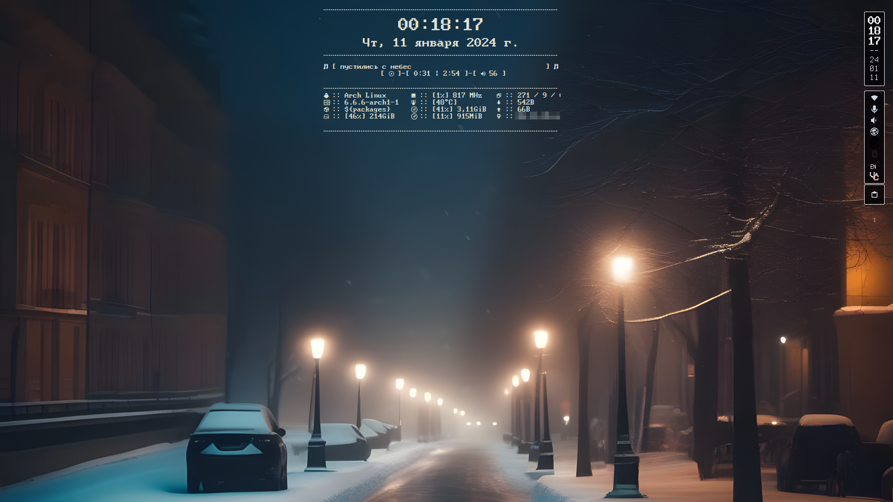
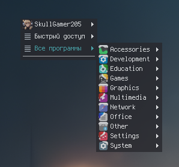
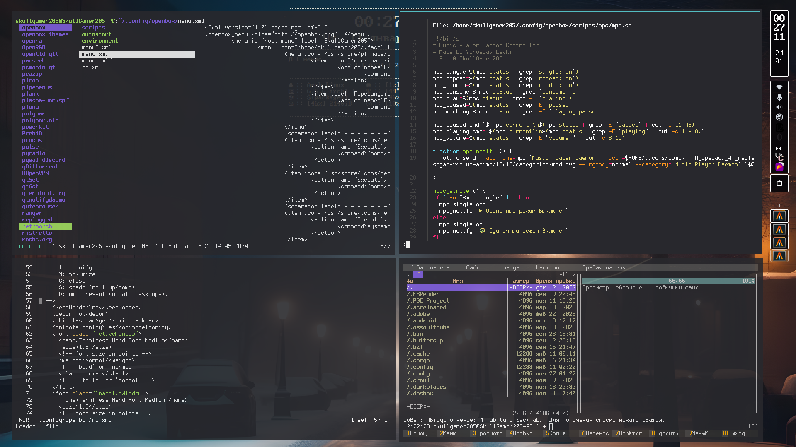

[🔙 Back](README.md) 

[🇷🇺 Русский](openbox/COLD_NIGHT/README-ru.md) | [🇺🇲 English](openbox/COLD_NIGHT/README.md)

### Cold Night
Theme created with Pywalfox
#### Preview










#### Steps to apply theme

1) **Install packages below** (I found these packages through `yay` in **Arch.** Other distributions **should**  (but are **not required**) to have similar ones...
	```
	{xorg}
		* xorg-server
		* xorg-xinit
		* xorg-xinput
		* xorg-xrandr
		* xorg-xkbcomp
		* xorg-setxkbmap
	{WM}
		* openbox
		* obkey
		* opensnap (Aero Snap Funcionality In Openbox)
		* obmenu-generator
		* mate-polkit (PolicyKit integration for the MATE desktop) (Works in OB)
	{WM-Deco}
		* nitrogen
		* picom-ftlabs-git
		* glava
		* conky
		* [ optional ] xsnow
	[ optional ] {GUI Options}
		* [ optional ] obconf (If you want a GUI OB Coifigurator)
		* [ optional ] lxappearance (If you want a GUI Theme editor)
		* [ optional ] lxappearance-obconf (If you want a "modern" "comfy" GUI for OB Theme configurator)
	{Bar}
		* tint2
		{Tray}
			* [ optional ] mictray (Lightweight application which lets you control the microphone state and volume from system tray)
			* [ optional ] network-manager-applet (Applet for managing network connections)
			* [ optional ] xxkb (keyboard layout switcher/indicator)
			* [ optional ] blueman (GTK+ Bluetooth Manager)
			* [ optional ] xfce4-battery-plugin (A battery monitor plugin for the Xfce panel) (And Tint2)
			* greenclip (Simple clipboard manager to be integrated with rofi)
			* rofi-greenclip
	{Tools}
		* flameshot (Screenshoter)
		* easystroke (Use mouse gestures to initiate commands and hotkeys)
		* betterlockscreen (A simple, minimal lockscreen)
	{Other}
		* [ FONT ] ttf-terminus-nerd
		* [ ICONS ] neru-icon-newyear-theme
``

2) Download this repository *( or "COLD_NIGHT" folder only)*.
3) Unzip repo somewere (In safe directory)
4) Edit some files ( Change **USER-NAME-PLACE-HERE** to **your username** *( Use `whoami` to find out your username)*.
5) Move the contents of the "COLD-NIGHT" folder, **except for the "PREVIEWS" folder**, to the required directories.
6) Apply custom theme with(-out) GUI.

**PROFIT.**
