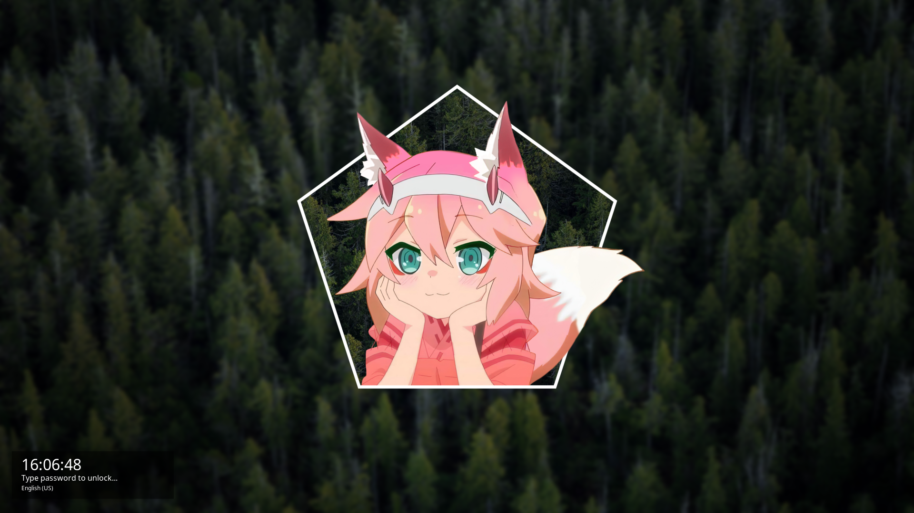
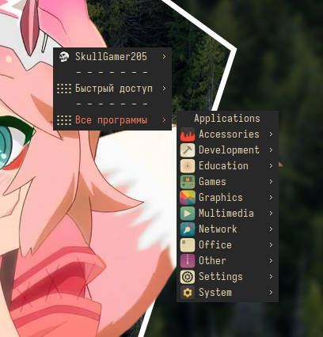
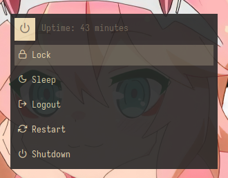

[🔙 Back](https://github.com/SkullGamer205/dotfiles/blob/main/README.md#gruvbox) 

[🇷🇺 Русский](README-ru.md) | [🇺🇲 English](README.md)

# Dotfiles
My Linux Desktop Configuration Compilation

# OpenBox
### Gruvbox
#### Preview

 

#### Steps to apply theme

* Install this packages: `alacritty openbox obmenu obmenu-generator xfce4-battery-plugin glava compton conky nitrogen pavucontrol pasystray betterlockscreen zsh oh-my-zsh-git`
* Drop content (exclude `PREVIEWS`) into folders
* Customize configurations (Change directories `/home/user/` and `/home/skullgamer205/` to your own)

Profit.

